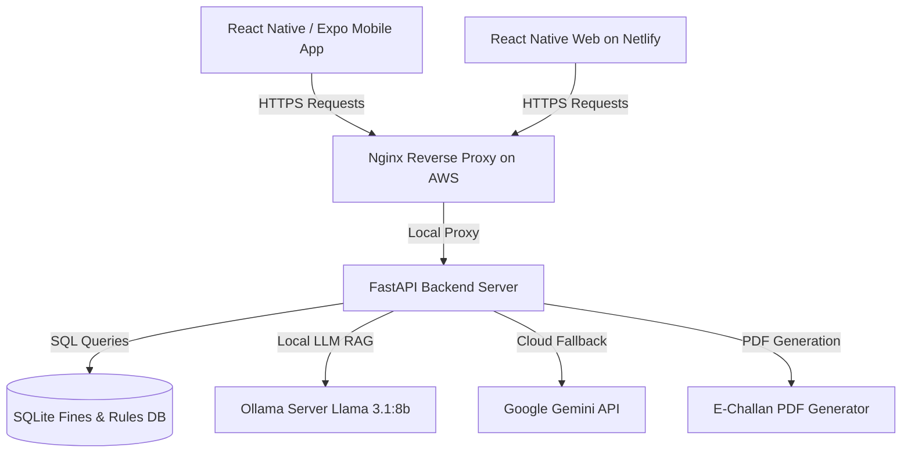

# ⚖️ DriveLegal — Hackathon Submission Guide

**Empowering Indian drivers with instant, location-specific, plain-language traffic laws, fines, and rights.**

---

## 🚀 Quick Links for Judges
* 📱 **Android APK Download:** [Install on Android](https://expo.dev/accounts/dk011/projects/drivelegal-mobile/builds/eae2a1f4-bb4e-4534-8108-147f97887d0d)
* 🌐 **Live Web App:** [drivelegal.netlify.app](https://drivelegal.netlify.app)
* ⚙️ **API Interactive Documentation:** [Swagger UI Docs](https://13.50.138.113.nip.io/docs)
* 📊 **API Health Endpoint:** [Health Check](https://13.50.138.113.nip.io/health)
*(Note: To manage cloud hosting budgets, our AWS GPU backend server runs daily from **9:00 AM to 5:00 PM**).*

---

## 💡 The Problem
Indian traffic rules and fines (governed by the Motor Vehicles Act and state-specific amendments) are notoriously complex, constantly updated, and hard to access on the road. 
1. **Lack of Transparency:** Citizens rarely know their exact legal rights during traffic stops, leading to corruption or compliance failure.
2. **State & Local Variations:** Fines for the exact same offense differ between Tamil Nadu, Delhi, and Karnataka.
3. **Language Barriers:** Legal jargon is inaccessible to the common driver, delivery agent, or trucker.

---

## 🌟 The Solution: DriveLegal
**DriveLegal** is a mobile-first, AI-driven legal assistant that puts plain-language traffic laws, state-specific fine lookups, and citizen reporting directly into drivers' pockets.

### Key Features:
1. **GPS-Aware Rules & Fines:** Automatically detects the user's state and local municipality to pull the correct legal codes (with specialized Tamil Nadu and Delhi database mapping).
2. **AI Legal Chatbot (RAG):** Powered by custom Retrieval-Augmented Generation. Users can ask questions in natural language (e.g., *"What is the fine for pillion rider no helmet in Chennai?"*) and get grounded legal answers cited from official rules.
3. **Photo Evidence E-Challan Reporter:** Citizens can capture and report traffic/parking violations. The app uploads the photo evidence, calculates the exact fine amount from the database, and automatically generates an official-looking **E-Challan PDF receipt** on the server.
4. **Offline Sync Support:** Critical offline safety fallback mechanisms built into the mobile app's database.

---

## 🛠️ System Architecture

Our stack is designed to be highly modular, secure, and production-ready:

### 1. Mobile & Web Frontend
* **Framework:** React Native + Expo (compiled into a standalone Android APK).
* **Web Distribution:** Exported via React Native Web and hosted on **Netlify** for instant load times and cross-platform accessibility.
* **UX/UI:** Clean, high-premium minimalist styling focusing on readability, micro-animations, and intuitive map integration.

### 2. High-Performance AWS Backend
* **Host:** AWS EC2 `g4dn.xlarge` instance equipped with an NVIDIA T4 GPU for lightning-fast local LLM inference.
* **Server:** **FastAPI** running under systemd for auto-restart resilience.
* **Reverse Proxy & Security:** **Nginx** handles incoming traffic on ports 80/443, secured with trusted **SSL Certificates** from **Let's Encrypt** (routed through a dynamic `nip.io` wildcard DNS).
* **Intelligence Layer (RAG):** Local **Ollama** server running `Llama-3.1` (with **Google Gemini 2.0 Flash** as a high-availability cloud fallback) combined with BM25 keyword matching for offline/fallback database query grounding.
